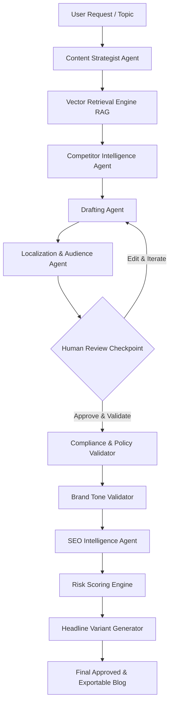

# 🛡️ ContentStudio: AI Blog Checker & Content Governance Engine

> An enterprise-grade, autonomous multi-agent AI pipeline for automated blog drafting, factual verification, regulatory compliance checking, brand tone alignment, and SEO optimization.

[](https://nextjs.org/)
[](https://fastapi.tiangolo.com/)
[](https://langchain-ai.github.io/langgraph/)
[](https://www.trychroma.com/)
[](https://tailwindcss.com/)
[](LICENSE)

---

## 📌 Overview

Generative AI makes writing blog posts effortless, but publishing in high-stakes industries (real estate, finance, healthcare, SaaS) creates severe risks:
- **Hallucinations & Fabrications:** AI creating non-existent features, dates, or prices.
- **Regulatory Non-Compliance:** Violating advertising standards, consumer protection codes, or missing mandatory disclaimers.
- **Brand Voice Erosion:** Shift into generic, overly salesy, or off-brand marketing fluff.
- **SEO Gaps:** Weak keyword density, missing headings, and poor readability structure.

**ContentStudio** solves this by wrapping the generative writing process in an autonomous **9-Agent Governance Pipeline** paired with a real-time **Human-in-the-Loop Review Dashboard**.

---

## 🏗️ Architecture & Multi-Agent Workflow

Built on **LangGraph**, every blog request moves sequentially through specialized agent nodes with state checkpoints:



### The 9-Agent Pipeline:
1. **Content Strategist Agent:** Formulates the core messaging angle, structure, and editorial brief.
2. **Retrieval Engine (RAG):** Fetches verified corporate and technical facts from ChromaDB using metadata-aware search.
3. **Competitor Intelligence Agent:** Scrapes competitor publications to contextualize industry positioning.
4. **Drafting Agent:** Generates long-form editorial copy restricted strictly to verified facts.
5. **Localization Agent:** Nuances stylistic tone based on target demographics (e.g., international investors vs. local buyers).
6. **Compliance & Policy Validator:** Scans line-by-line for regulatory violations, unverified superlatives, and quotes the exact offending text.
7. **Brand Tone Validator:** Enforces sophisticated, understated brand voice and eliminates forbidden sales buzzwords.
8. **SEO Intelligence Agent:** Evaluates target keyword frequency, heading hierarchy, and meta-readiness.
9. **Risk Scoring Engine:** Generates granular scores (Factual, Compliance, Brand, SEO) and assigns overall risk (`Low`, `Medium`, `High`).
10. **Headline Variant Generator:** Produces 5 high-converting, SEO-optimized title variants.

---

## ✨ Key Features

### 🔍 Factual Verification via RAG
Cross-references every statement in the draft against an ingested knowledge base stored in ChromaDB vector storage. If a claim lacks backing data, the system flags it as an ungrounded risk.

### ⚖️ Precision Compliance & 1-Click Fixes
The compliance validator doesn't just give general advice—it extracts the **exact quoted text** and proposes a compliant rewrite. Users can click **Apply Fix** to automatically replace the offending sentence in the editor.

### ✍️ Human-in-the-Loop Editorial Studio
- **Side-by-Side Review:** Live markdown editor alongside agent assessments and logs.
- **Diff Viewer:** Visual word-level diff showing modifications between drafts and revisions.
- **Version Tracking:** Full revision history (v1 AI generation, v2 human review, v3 post-validation).
- **Multi-Format Export:** 1-click export to branded PDF or Microsoft Word (DOCX).

### 📊 Executive Analytics & Project Risk Matrix
- Portfolio-level metrics on total generated content, approval rates, and high-risk flags.
- **Project Health Matrix:** Cross-category comparison of compliance, factual, and brand scores.
- **Top Vulnerabilities:** Automatically aggregates and ranks recurring compliance failures.

---

## 🎯 Domain Customization

While pre-configured with a luxury real estate compliance pack (RERA regulatory rules), the engine is completely modular and can be customized for any industry in minutes:

| Industry | Knowledge Base Content | Compliance Rules |
| :--- | :--- | :--- |
| **SaaS & Tech** | API docs, feature specs, pricing tiers | Feature hallucination, SLA promises, GDPR/SOC2 claims |
| **Healthcare** | Clinical studies, drug labels, approved treatments | Medical claim guarantees, FDA disclosure compliance |
| **Finance / FinTech** | Fund performance data, fee schedules | SEC/FINRA return guarantees, risk disclaimer presence |
| **Real Estate** | Architectural specs, approvals, registered amenities | RERA registration, unregistered claims, investment guarantees |

To ingest custom facts, update `backend/ingest_knowledge.py` and run the ingestion pipeline.

---

## 🚀 Quick Start Guide

### Prerequisites
- Node.js 18+ and npm
- Python 3.9+
- Google Gemini API Key (or OpenRouter / OpenAI API Key)

---

### 1. Backend Setup

```bash
# Navigate to backend
cd backend

# Create and activate virtual environment
python3 -m venv venv
source venv/bin/activate   # On Windows: venv\Scripts\activate

# Install dependencies
pip install -r requirements.txt  # Or install core packages below:
pip install fastapi uvicorn pydantic langchain-core langchain-google-genai langchain-openai langgraph langchain-chroma chromadb python-dotenv beautifulsoup4 reportlab python-docx

# Setup environment variables
cp .env.example .env
# Edit .env and add your GOOGLE_API_KEY or OPENROUTER_API_KEY

# Ingest initial knowledge base into ChromaDB
python ingest_knowledge.py

# Start the FastAPI server
uvicorn main:app --host 127.0.0.1 --port 8000 --reload
```

---

### 2. Frontend Setup

```bash
# In the project root
npm install

# Start the Next.js dev server
npm run dev
```

Open [http://localhost:3000](http://localhost:3000) (or `http://localhost:3005`) in your browser.

---

## ⚙️ Environment Variables

Create a `backend/.env` file with the following:

```env
# LLM Provider: 'google' or 'openrouter'
LLM_PROVIDER=google

# Google Gemini API
GOOGLE_API_KEY=your_gemini_api_key_here

# Optional: OpenRouter (if using Claude, GPT-4o, etc.)
OPENROUTER_API_KEY=your_openrouter_api_key_here
OPENROUTER_MODEL=google/gemini-2.5-flash

# Optional: Competitor sites to scrape for intelligence
COMPETITORS=https://example.com,https://competitor.com
```

---

## 📡 API Reference

| Method | Endpoint | Description |
| :--- | :--- | :--- |
| `POST` | `/api/v1/requests/` | Submit new blog request & start agent pipeline |
| `GET` | `/api/v1/requests/{id}/status` | Poll real-time progress, scores & logs |
| `POST` | `/api/v1/requests/{id}/resume` | Approve edited draft & trigger validation agents |
| `POST` | `/api/v1/requests/{id}/rerun` | Re-run full validation pass on modified text |
| `POST` | `/api/v1/requests/{id}/reject` | Reject and archive draft |
| `GET` | `/api/v1/analytics/` | Aggregate platform compliance metrics & health scores |
| `GET` | `/api/v1/health/` | Service health status check |
| `GET` | `/api/v1/export/{id}/{format}` | Download final document as `pdf` or `docx` |

---

## 📁 Repository Structure

```
├── backend/
│   ├── agents/
│   │   ├── llm_factory.py     # Provider-agnostic LLM initialization
│   │   └── workflow.py        # LangGraph 9-agent governance state machine
│   ├── routers/
│   │   ├── requests.py        # Draft pipeline orchestration & CRUD
│   │   ├── analytics.py       # Portfolio compliance analytics
│   │   ├── knowledge.py       # Vector DB inspection endpoints
│   │   ├── export.py          # PDF & DOCX export generator
│   │   └── health.py          # API & database health checks
│   ├── database.py            # SQLite schema, versioning & persistence
│   ├── ingest_knowledge.py    # ChromaDB RAG ingestion pipeline
│   └── main.py                # FastAPI application entrypoint
├── src/
│   ├── app/
│   │   ├── page.tsx           # Governance dashboard & draft table
│   │   ├── requests/new/      # 3-step blog generation wizard
│   │   ├── requests/[id]/     # Real-time animated pipeline tracker
│   │   ├── review/[id]/       # Document editor, diffs & compliance review
│   │   ├── analytics/         # Quality metrics & project risk matrix
│   │   └── knowledge/         # Grounding knowledge base browser
│   └── components/
│       ├── layout/            # App sidebar, navigation & headers
│       └── ui/                # shadcn/ui design system components
└── README.md
```

---

## 🛡️ License

This project is licensed under the [MIT License](LICENSE).
